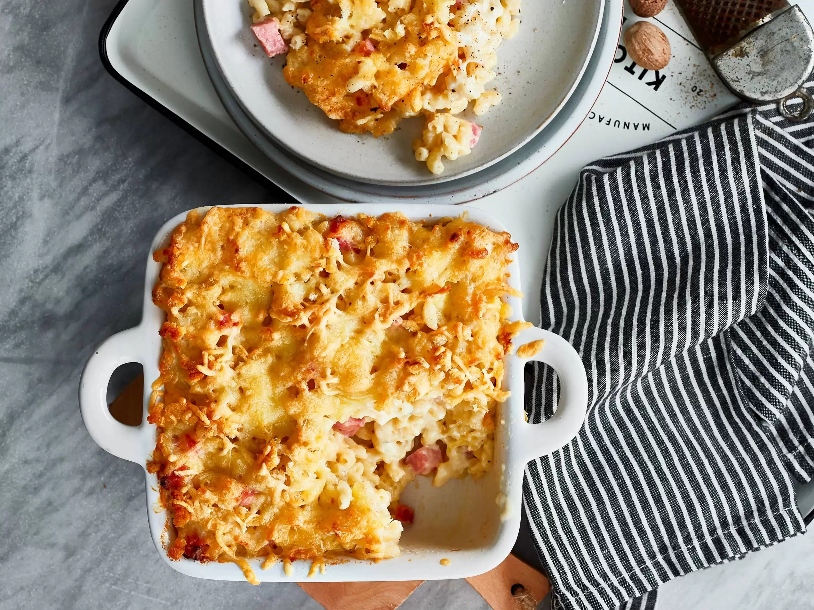

# skil_markdown_les
# Classic mac & cheese
 

## BENODIGDHEDEN
300 gram macaroni
70 gram boter
40 gram bloem
500 milliliter melk
150 gram oude kaas (geraspt)
150 gram jonge kaas (geraspt)
nootmuskaat
250 gram hamblokjes
2 sneeën witbrood (verkruimeld)
### BEREIDING
1 Verwarm de oven voor op 200ºC. Kook de macaroni volgens de aanwijzingen op de verpakking, maar haal 2 minuten van de kooktijd af zodat de pasta nog net niet gaar is.
2 Verhit de boter in een (steel)pan en voeg de bloem toe. Blijf roeren tot er een roux ontstaat. Voeg vervolgens langzaam de melk toe en roer met een garde tot een romige saus.
3 Voeg 100 gram oude en 100 gram jonge kaas toe en roer door totdat deze gesmolten is. Breng op smaak met zout, peper en nootmuskaat.
4 Meng de kaassaus en hamblokjes door de macaroni en schep in de ovenschaal. Bestrooi met het broodkruim en de rest van de kaas. Bak in de oven in circa 20 minuten goudbruin.
[link naar recept](https://www.boodschappen.nl/recept/classic-mac-a-cheese/)
